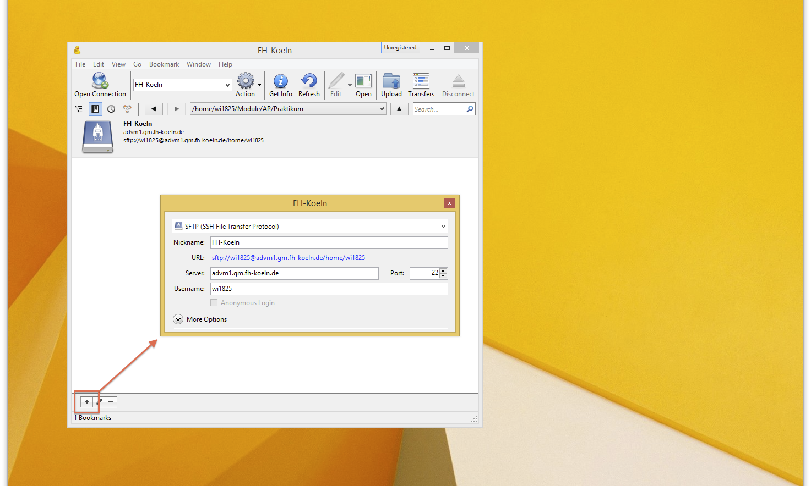
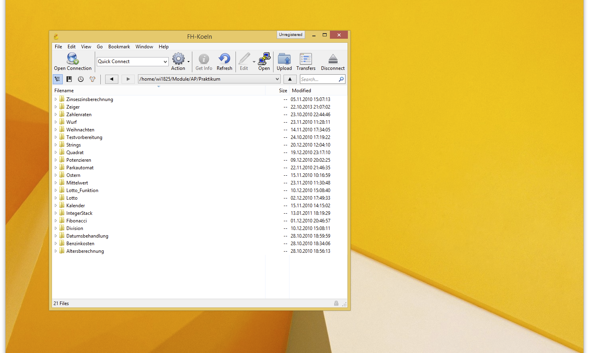
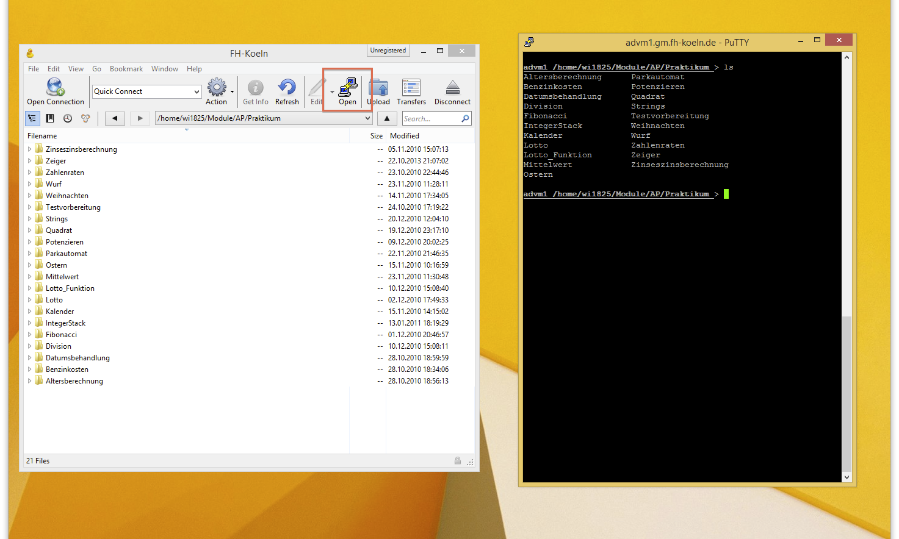
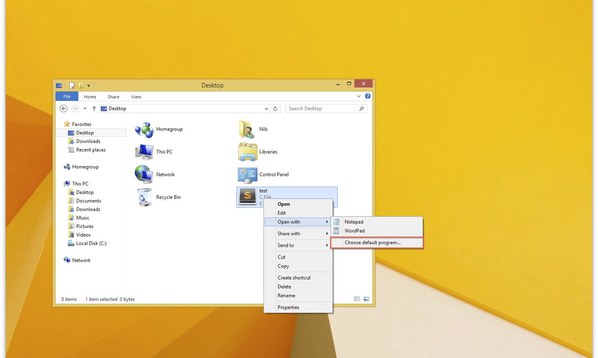
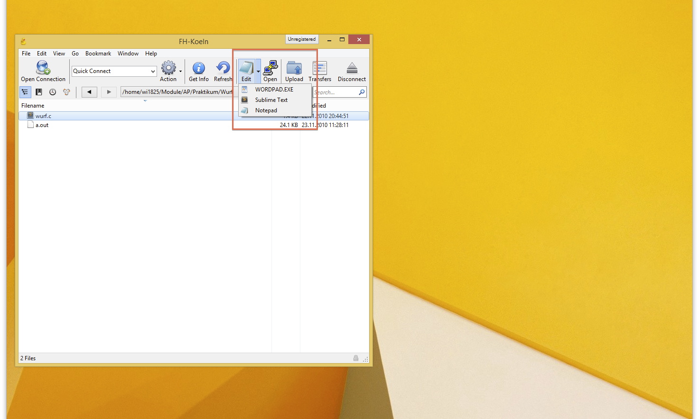
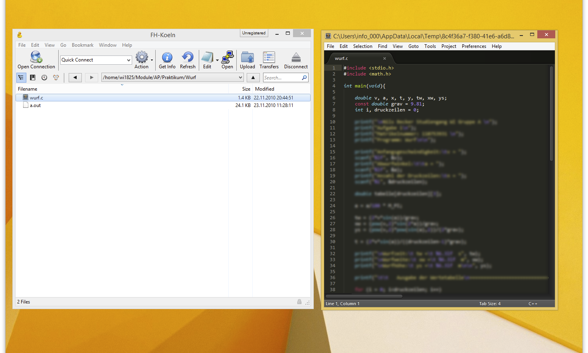

# SFTP-Verbindung mit Cyberduck aufbauen
Im Folgenden soll der Verbindungsaufbau zur `advm1` mit Hilfe der Software `Cyberduck` beschrieben werden. Darüber hinaus wird der Aufruf von `Putty` und `Sublime Text` aus einer geöffneten Cyberduck-Verbindung heraus gezeigt. **Die Abgabe der Praktikumsaufgaben soll aber bitte weiterhin mit der vorgeschriebenen Methode erfolgen!**

**Benötigte Software:**

  - [Cyberduck](http://cyberduck.ch/)
  - [Sublime Text](http://www.sublimetext.com/)
  - [Putty](http://www.chiark.greenend.org.uk/~sgtatham/putty/download.html)

## Verbindungsaufbau mit Cyberduck
Wurde Cyberduck installiert und gestartet, kann eine neue Verbindung über das kleine Plus-Zeichen am unteren linken Bildschirmrand hinzugefügt werden.

Für die Verbindung sind die folgenden Daten anzugeben:

  - **Typ:** SFTP
  - **Nickname:** FH-Koeln (optional)
  - **Server:** advm1.gm.fh-koeln.de
  - **Benutzername:** Eure Benutzerkennung an der advm1

Das Schließen des Fensters speichert die Verbindung, welche nun in den "Bookmarks" auftauchens sollte. Die Verbindung wird mit einem Doppelklick geöffnet.

Standardmäßig listet Cyberduck nun euer Home-Verzeichnis auf. Die Software bietet nützlicherweise auch eine Möglichkeit, aus einer geöffneten `SFTP-Verbindung` heraus eine `SSH-Verbindung mit Putty` zu starten. Hierfür wird zunächst der entsprechende Eintrag in der Toolbar eingeblendet.

Eine weitere Vorraussetzung ist, dass die `Putty.exe` in eurem Home-Verzeichnis (Eigene Dateien) liegt. Ist dies nicht der Fall, so ist das Putty-Symbol ausgegraut und Cyberduck kann das Programm nicht starten.

Wurde alles korrekt eingerichtet, startet Putty eine neue Verbindung und wechselt automatisch in das aktuell geöffnete Verzeichnis.

## Editieren mit Sublime Text
Um die C-Programme direkt aus einer offenen Cyberduck-Verbindung heraus bearbeiten zu können, empfiehlt sich ein Code-Editor wie Sublime Text. Grundsätzlich funktioniert diese Anleitung aber für jeden beliebigen Texteditor.

Damit Sublime Text im Eintrag "Bearbeiten mit" unter Cyberduck auftaucht, muss dieser lediglich als Standardeditor für C-Dateien festgelegt werden.

Am einfachsten ist es, einmalig eine C-Datei auf dem eigenen Rechner zu öffnen, und Sublime Text als Standardeditor festzulegen. Der Dialog ist je nach Windows-Version unterschiedlich. Einmalig als Standardeditor gesetzt, tauch Sublime Text nun auch im Kontexteintrag von Cyberduck auf.

Ist also alles richtig konfiguriert, kann die Datei nun im externen Editor bearbeitet werden. Beim Speichern der Datei wird diese von Cyberduck automatisch mit der `advm1` synchronisiert.

