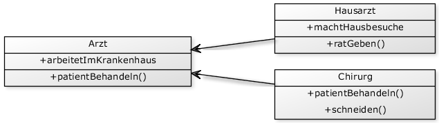

# Termin 5

## Vererbung und Interfaces

### Aufgabe 1
Der folgende Quellcode ist stellenweise fehlerhaft. Es sollen alle Fehler gefunden und fachlich korrekt begründet werden.

    public static void main(String[] args) {
      Hund schaeferhund = new Hund(true, "Rex"); 
      Vogel kohlmeise = new Vogel(false, "Gelb"); 
      Hund vogel = new Hund(false, "Ben");
      Vogel drossel = new Tier(true);
      Tier labrador = new Hund(true, "Felix");
    
      Tier[] meineTiere = new Tier[2];
      meineTiere[0] = schaeferhund; 
      meineTiere[1] = kohlmeise;
      
      for (Tier tier : meineTiere) { 
        tier.gibLaut();
        tier.flieg();
        if (tier instanceof Fluegel) {
          ((Fluegel) tier).flieg();
          tier.flieg();
        }
      }
    
      for (Vogel einVogel : meineTiere) { 
        einVogel.flieg();
      } 
    }

### Aufgabe 2
Betrachten Sie folgende Klassenhierarchie und die bereits implementierte Klasse `Arzt`. Ergänzen Sie die noch fehlende Implementation von `Chirurg` und `Hausarzt`.

    public class Arzt {

      public boolean arbeitetImKrankenhaus;

      public void patientBehandeln() {
        System.out.println("Ich untersuche den Patienten!");
      }

    }

__Zusatzaufgabe:__
Es soll in einem weiteren Schritt dafür gesorgt werden, dass beim Anlegen eines Chirugs dieser immer im Krankenhaus arbeitet (Instanzvariable `arbeitetImKrankenhaus` auf true setzen)? Bei einem Hausarzt soll dies hingegen dem Konstruktor direkt übergeben werden:

  Chirug einChirug = new Chirug();
  Hausarzt einHausarzt = new Hausarzt(true);

Wie muss demnach der Konstruktor für Chirug und Hausarzt aussehen?

