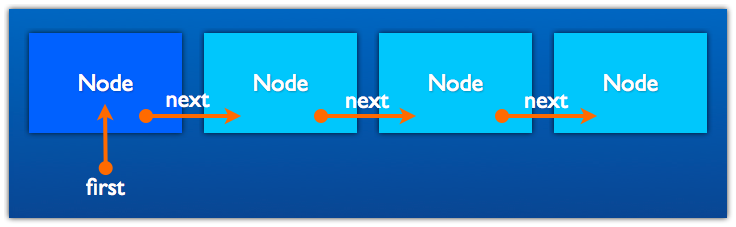

# Termin 9

## Verkettete Liste

### Aufgabe 1
Die bisher gezeigte Implementierung der vergetteten Liste soll um die folgenden Methoden ergänzt werden:
 
```java
public boolean contains(T obj)
public void addLast(T obj)
public boolean remove(T obj)
```

Orientieren Sie sich am Vorgegebenen Klassenkonstrukt `SinglyLinkedList`:
 
 ```java
public class SinglyLinkedList<T> {

  private int size = 0;

  private static class Node<T> {
    T value;
    Node<T> next;

    private Node(T value, Node<T> next) {
      this.value = value;
      this.next = next;
    }
  }
    
  Node<T> first = null;
}
```



Welche Laufzeit haben die drei Methoden?
