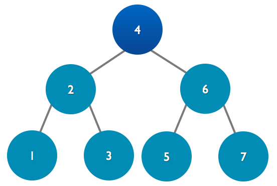

# Termin 10

## Binärbaum

### Aufgabe 1
Es soll der im Vortrag gezeigte Binärbaum um die folgenden Methoden ergänzt werden:

```java
void preOrder()
void postOrder()
int nodeCount(TreeNode p)
Node findNode(Node p, String key)
```
__Zur Erinnerung:__

```java
public abstract class TreeNode {
  protected TreeNode left;
  protected TreeNode right;

  public TreeNode() {
    this(null, null);
  }

  public TreeNode(TreeNode left,TreeNode right) {
    this.left = left;
    this.right = right;
  }
}
```
__Grafische Darstellung:__

