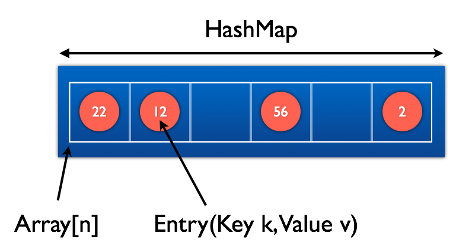

# Termin 11

## HashMap

### Aufgabe 1
Für die im Vortrag gezeigte HashMap sollen die folgenden Methoden geschrieben werden:

```java
public Entry findEntry(String key)
public boolean contains(String key)
public void put(String key, Ojbect value)
```
__Hilfestellung für die Methode put(...):__

```java
public void put(String key, Ojbect value) {
  1. Position im Array bestimmen -> hashCode
  2. Solange verschieben bis:
    2.1. Das Feld leer ist -> Neuen Entry anlegen
      2.1.1 mapEntries inkrementieren
    2.2. Der Key bereits existiert -> Value überschreiben 
  (Die Verdopplung des Arrays muss nicht implementiert werden)
}
```

__Zur Erinnerung:__

```java
public class HashMap implements IMap {
  
  private class Entry {
    
    Entry(String key, Object value) {
      this.key = key;
      this.value = value;
    }

    String key;
    Object value;
  }

  private int mapEntries = 0;
  private Entry[] data;
  private int N_MAX;

  public HashMap(int arraySize) {
    N_MAX = arraySize;
    data = new Entry[N_MAX];
  }
}
```



